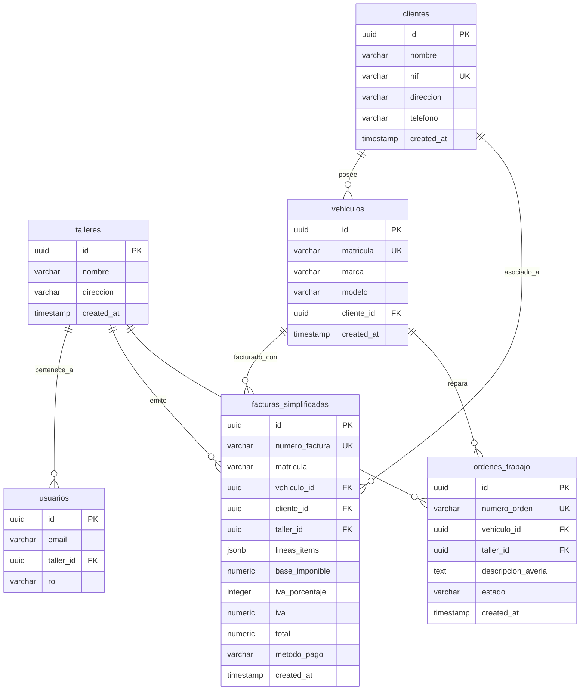

<p align="center">
  
</p>

<p align="center">
  
  
  
  
  
  
</p>

<br />

# 🔧 TallerÁgil — Sistema de Gestión para Talleres Mecánicos

**Proyecto Intermodular · 1º GS Desarrollo de Aplicaciones Multiplataforma (DAM)**  
**Alumno:** Daniel Almaquio

---

TallerÁgil es una app web creada especialmente para talleres mecánicos pequeños y medianos.
Es una herramienta sencilla que acompaña el día a día del taller: desde que llega un coche y se abre la orden de trabajo, hasta que se termina la reparación y se cobra en caja de forma rápida.
La idea principal es dejar atrás el papel, los Excel y las notas sueltas, y tener todo en un solo lugar.
Lo mejor es que cualquier mecánico puede usarlo fácilmente desde el móvil o la tablet mientras está al lado del vehículo, sin complicaciones ni necesidad de cursos previos.
El proyecto nació en un taller real. Empezó como un simple bot de Telegram, fue evolucionando validando con el taller las necesidades de negocio.

---

## ✨ Funcionalidades principales

### ⚡ Facturación
Emite facturas simplificadas en segundos. Incluye plantillas preconfiguradas para las operaciones más habituales (pinchazo, cambio de aceite, batería).

### 🛑 Control legal del límite de 400 €
El sistema detecta en tiempo real cuando el importe acumulado de un ticket anónimo se acerca al límite legal. En ese momento bloquea la emisión y obliga a vincular una ficha de cliente antes de continuar. Sin intervención manual, sin errores.

### 📋 Gestión de Órdenes de Reparación
Creación y seguimiento de una reparación: Cada orden registra el vehículo, la descripción de la avería y los trabajos realizados.

### 🚗 Fichas relacionales automáticas
Al introducir una matrícula conocida, el sistema autocompleta automáticamente el propietario y recupera su historial vinculado. Sin duplicidades, sin búsquedas manuales.

### 🔍 Búsqueda reactiva en tiempo real
Filtrado instantáneo en los listados de Clientes, Vehículos, Órdenes y Facturas por número de documento, matrícula o nombre. Sin recargas de página.


---

## 🛠️ Stack tecnológico

| Capa | Tecnología |
|---|---|
| Framework | Next.js 16 (App Router, Server & Client Components) |
| Lenguaje | TypeScript 5 (tipado estricto) |
| Base de datos y auth | Supabase (PostgreSQL + Row Level Security) |
| Estilos | Tailwind CSS 4 |
| Componentes UI | Radix UI + shadcn/ui |
| Iconos | Lucide React |
| React | React 19 |

---

## 📊 Modelo de base de datos

La BBDD usa **PostgreSQL** a través de **Supabase**, con claves foráneas, restricciones de unicidad.



> **Decisión de diseño:** Las líneas de detalle de cada factura se almacenan directamente en un campo `jsonb`. Esto garantiza que el histórico de facturación sea inmutable e independiente de cambios futuros en catálogos o tarifas, sin necesidad de tablas pivote adicionales para el módulo express.

---

## 📁 Estructura del proyecto

```
src/
├── app/
│   ├── api/
│   │   └── taller/plan/      # Endpoint de info del plan activo
│   ├── clientes/             # CRUD completo de fichas de clientes
│   │   ├── detalle/          # Vista y edición de un cliente
│   │   └── nuevo/            # Alta de nuevo cliente
│   ├── vehiculos/            # Gestión de flota y vinculación relacional
│   │   ├── detalle/
│   │   └── nuevo/
│   ├── ordenes/              # Ciclo de vida de reparaciones
│   │   ├── nueva/
│   │   └── page.tsx          # Listado con filtros por estado
│   ├── facturas/             # Terminal de cobro express e histórico
│   ├── globals.css
│   ├── layout.tsx
│   └── page.tsx              # Dashboard principal
├── components/
│   ├── clientes/             # Sheets y formularios de cliente
│   ├── ordenes/              # Componentes específicos de órdenes
│   ├── vehiculos/            # Sheet de detalle de vehículo
│   ├── dashboard/            # Header y Sidebar
│   └── ui/                   # Componentes atómicos reutilizables
├── lib/
│   └── utils/                # Converters y utilidades
├── types/                    # Tipos TypeScript del dominio
│   ├── cliente.ts
│   ├── vehiculo.ts
│   ├── factura.ts
│   └── database.types.ts     # Tipos generados desde Supabase
└── utils/
    └── supabase/
        ├── client.ts         # Cliente para componentes de cliente
        └── server.ts         # Cliente para Server Components
```

---

## 🚀 Instalación local

### Requisitos previos
- Node.js 18+
- Una cuenta en [Supabase](https://supabase.com) con el proyecto configurado

### Pasos

```bash
# 1. Clonar el repositorio
git clone [https://github.com/Dani0091/taller-proyecto-GS.git](https://github.com/Dani0091/taller-proyecto-GS)
cd taller-saas-gs

# 2. Instalar dependencias
npm install

# 3. Configurar variables de entorno
cp .env.example .env.local
```

Edita `.env.local` con tus credenciales de Supabase:

```env
NEXT_PUBLIC_SUPABASE_URL=tu_url_de_supabase
NEXT_PUBLIC_SUPABASE_ANON_KEY=tu_clave_anonima
```

```bash
# 4. Arrancar el servidor de desarrollo
npm run dev
```

La app estará disponible en [http://localhost:3000](http://localhost:3000).

---

## 📸 Capturas de pantalla

| Dashboard Principal | Facturación Express |
|:---:|:---:|
|  | 
|

---

## 🧭 Roadmap

- [x] CRUD de clientes y vehículos
- [x] Órdenes de reparación sencillas
- [x] Facturación simplificada con control del límite de 400 €
- [x] Búsqueda reactiva en tiempo real (en proceso...)
- [x] Dashboard con métricas básicas
- [ ] Informes y exportación a PDF
- [ ] Autenticación multi-taller (multi-tenant)
- [ ] App móvil nativa (React Native)

---

## 📄 Licencia

Proyecto académico desarrollado para el módulo intermodular del ciclo **1º GS DAM**.  
Todos los derechos reservados © Daniel Almaquio.

---

## ✉️ Contacto

**Daniel Almaquio**  
Proyecto Intermodular · 1º GS Desarrollo de Aplicaciones Multiplataforma (DAM)  
Digitalización, trazabilidad relacional y automatización de procesos en pymes de automoción.
